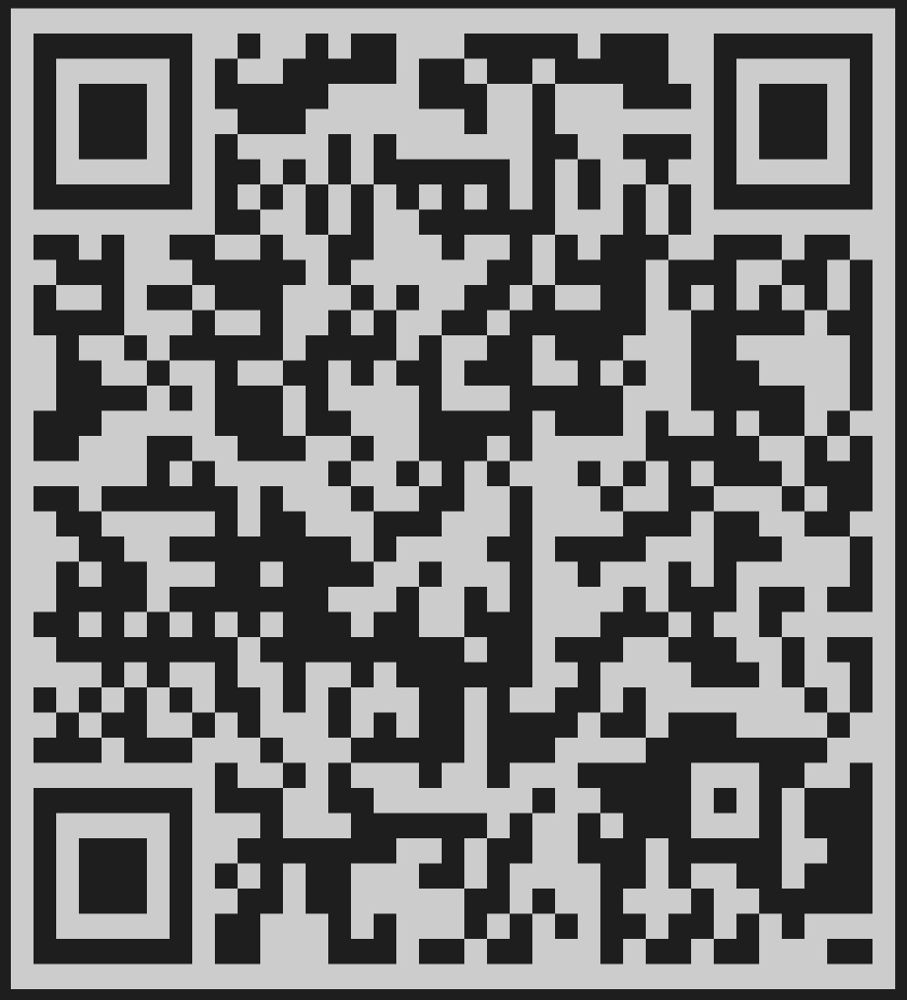

# PicToSolver 🎴

PicToSolver is a React Native mobile application built with Expo that allows users to instantly import printed bridge hands directly into the BridgeWebs/Bridge Solver engine just by taking a picture!

## How It Works
1. **Snap a photo** of a printed bridge diagram (or upload from your gallery).
2. The app passes the image to **Google's Gemini 2.5 Flash** vision model, which strictly extracts the 4 hands into standard Portable Bridge Notation (PBN).
3. The app bypasses the BridgeWebs upload page by computing the BBO `lin=` URL parameters and natively embedding the analyzed board directly into an in-app browser.
4. You can then instantly view the makeable contracts or open the exact board in your phone’s default web browser.

## Getting Started (Development)
If you are developing or running the app locally using Expo Go:
1. Obtain a free Gemini API key from [Google AI Studio](https://aistudio.google.com/).
2. Run `npm install` to install dependencies.
3. Run `npx expo start --tunnel` and scan the QR code with the Expo Go app.
4. On first launch, the app will prompt you to enter your Gemini API key (which is securely saved to your local device).

## Downloading the App (Permanent APK)
Because Expo Go development links expire as soon as you turn your computer off, the best way to share the app is via a standalone `.apk` build!

You can view the build details and download the compiled Android app directly here:
> **🔗 [Expo Build Dashboard](https://expo.dev/accounts/apyszko/projects/PicToSolver/builds/a14dfc47-e2d1-4899-9c97-f5c00723e0c3)** 
> **📲 [Direct APK Download](https://expo.dev/artifacts/eas/a14dfc47-e2d1-4899-9c97-f5c00723e0c3.apk)** 

Alternatively, scan this permanent QR code with your Android phone to install the app:

## Built With
- **React Native** & **Expo**
- **@google/generative-ai** (Gemini 2.5 Flash Vision)
- **@react-native-async-storage**
- **react-native-webview**
